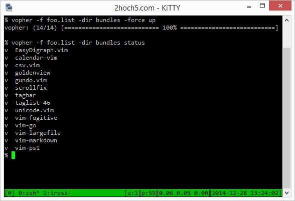

# VOPHER - Acquire vim-plugins the gopher-way

## Usage

    usage: vopher [flags] <action>

    actions
      update - acquires the given plugins from the -f <list>
      search - uses http://vimawesome.com/ to list some plugins
      check  - checks plugins from -f <list> against a more
               recent version
      clean  - removes given plugins from the -f <list>
      prune  - removes all entries from -dir <folder>
               which are not referenced in -f <list>.
               use -force=true to actually delete entries.
               use -all=true to also delete <plugin>.zip
               entries.
      status - lists plugins in -dir <folder> and marks missing or
               referenced and unreferenced plugins accordingly
      sample - prints sample vopher.list to stdout

    flags
    -all=false: don't keep <plugin>.zip around
    -dir=".": directory to extract the plugins to
    -dry=false: dry-run, show what would happen
    -f="": path to list of plugins
    -filter=: only use plugins filtered
    -force=false: force certain actions
    -ui="oneline": ui mode

## Building / Installation

To build *vopher* a working Go compiler is needed. Then
do this:

    $> cd /somewhere
    $> env GOPATH=`pwd` go get -v github.com/mgumz/vopher

This will fetch and build *vopher* in the "somewhere/bin" directory.
Copy it to any place you need it.

To build *vopher* with support for Lzma:

    $> env GOPATH=`pwd` go get -v -tags lzma github.com/mgumz/vopher

## The vopher-file format

The vopher-file is pretty simple:

    # a comment starts with a '#'
    # empty lines are ignored

    # fetches vim-fugitive, current HEAD
    https://github.com/tpope/vim-fugitive

    # fetches vim-fugitive, tagged release 'v2.1'
    https://github.com/tpope/vim-fugitive#v2.1.zip

    # fetches vim-fugitive, name the output-folder 'foo'
    foo https://github.com/tpope/vim-fugitive

    # fetches vim-fugitive, apply some options to the
    # parser/extractor
    https://github.com/tpope/vim-fugitive option1=foo option2=bar

## Supported archive types

* .zip
* .vba and .vba.gz (see [Charles E. Campbell](http://www.drchip.org/astronaut/vim/doc/pi_vimball.txt.html))
* .tar.gz, .tar.bz2, .tar.bzip2
* optional: .tar.lzma, .tar.xz

## Sample session

    $> cd ~/.vim

Acquire all of the plugins referenced in 'vopher.list':

    $> vopher -f vopher.list -dir bundles up
    vopher: (10/10) [=================== 100% ====================]

Let's check for updates / new stuff:

    $> vopher -f vopher.list -dir bundles -ui simple check
    ## goldenview - https://github.com/zhaocai/GoldenView.Vim#V1.3.5

    - master commits:

      31af855bd5 2014-09-08T08:41:49-04:00 Merge pull request #15 from lllama/patch-1
      0bb152d6d3 2014-08-18T10:55:38+03:00 Update Installation instructions with correct git link
      495a5cef06 2013-10-28T10:18:34-04:00 [admin] update zl
      c6c669b30d 2013-10-28T10:18:34-04:00 [minor] Do not open empty buffer by default
      f726e8885f 2013-10-28T10:18:34-04:00 [minor] tweak minheight
      91d52f86e6 2013-10-28T03:23:52-07:00 Merge pull request #10 from jvanbaarsen/patch-1
      39e97ad002 2013-10-28T10:53:41+01:00 Update README.md
      60f6c3e5a8 2013-05-07T21:42:48-04:00 [admin] update vimup message
      323a1f6c85 2013-05-07T21:17:45-04:00 [admin] update zl.vim
      0b1f325ba0 2013-04-27T20:23:37-04:00 [update] increase GoldenMinHeight
     *c23469a0bc 2013-04-26T17:10:53-04:00 [fix] Dirdiff
      c118d96660 2013-04-26T16:37:33-04:00 [minor] update GoldenViewTrace code
      ...

    - commits:

     *c23469a0bc 2013-04-26T17:10:53-04:00 [fix] Dirdiff
      c118d96660 2013-04-26T16:37:33-04:00 [minor] update GoldenViewTrace code
      ...

    - tags:

     *V1.3.5 2013-04-26T21:11:48Z V1.3.5
      V1.3.0 2013-04-22T21:57:01Z V1.3.0
      ...

'GoldenView.Vim#V1.3.5' is referenced in the vopher.list-file. vopher tries to
guess what commit this actually is and marks that line with a '\*'. so, you can
easily see that there seems to be no new release for 'GoldenView', allthough
there are some new commits.

So, what's in my 'bundles' directory and how do they relate to my
vopher.list-file?

    $> vopher -f vopher.list -dir bundles status
    v  EasyDigraph.vim
       buftabs
    v  goldenview
    v  unicode.vim
       vim-bbye
       vim-bufferline
    vm vim-fugitive
       vim-gitgutter
    v  vim-go
       vim-jinja

Lines marked with 'v' are plugins referenced in the vopher.list. 'vm' marked
lines are referenced plugins which are missing (acquire them by using the
'update' action). lines without a special prefix are folders inside 'bundles'
but they are not handled by vopher.

I need more color! Are there any colorschemes available?

    $> vopher search colors
    5856 vim-colors-solarized precision colorscheme for the vim text editor
       github: https://github.com/altercation/vim-colors-solarized

    1151 vim-colorschemes one colorscheme pack to rule them all!
       github: https://github.com/flazz/vim-colorschemes

    482 vividchalk.vim vividchalk.vim: a colorscheme strangely reminiscent of Vibrant Ink for a certain OS X editor
          vim: http://www.vim.org/scripts/script.php?script_id=1891
       github: https://github.com/tpope/vim-vividchalk

    459 vim-css-color Highlight colors in css files
       github: https://github.com/ap/vim-css-color

    416 unite-colorscheme A unite.vim plugin
          vim: http://www.vim.org/scripts/script.php?script_id=3318
       github: https://github.com/ujihisa/unite-colorscheme
    ...

## FAQ

> There is no vim-integration!!

Yep, nothing to see on this front here .. yet. I need some means to exchange
messages between vim and vopher in an asyncronous way, without the need for
+clientserver. I am also not so sure that the effort on integrating *vopher*
into the Vim-ui is really worth it: I use *vim* as my text editor, not as a
means to constantly updating and managing the plugins I use. Thus, I consider
using *vopher* a rare case. Using the command line outside of *vim* is fine
for me right now.

> Why??

*pathogen* (which is what I use) has no means on it's own to acquire plugins.

*vundle* needs *git*. It fetches the whole history of any plugin. I am not
interested in the history, I am just interested in a certain snapshot for
a certain vim-plugin. In addition to that: the installation of *git* on Windows
takes up ~ 250mb. The sum of my vim-plugins take up ~ 4mb.

*Neobundle* depends on *git* or *svn*.

> But why not use curl?? Or python??? Or ruby???

*curl* is easy to install and available everywhere. But it's a bit stupid on
it's own. I would have to write a lot of what *vopher* does on it's own in a
real programming language 'x'. Or VimL (vimscript). Which would lead to even more
code and maybe an additional interpreter which might need even more stuff. On
Windows the curl-binary which supports https weighs ~ 1.6mb. A python
installer for Windows weighs ~ 17mb, installed ~ 60mb. Yeah, one could create
a standalone binary with something like *PyInstaller*. This does not give
anything substantially better than the *golang* binary and it's builtin network-
and concurrent powers.

> But Python and Ruby are just a `brew install` away?

Yep. If you are working mostly on the same platform you can get very
comfortable with your nice and cosy environment. If you switch platform
borders on a regular basis, things become a bit more complicated. I want to
place one .zip file on my server, containing all my vim-files, vopher-binaries
and then I am ready to go (pun) in no time.

> Will *vopher* handle all the dependencies for me?

Nope. There is no central repository for plugins which all of the
plugin-writers agree on (in contrast, SublimeText3 has the defacto standard
https://packagecontrol.io/installation ). Ontop of that something like a
file-format for dependencies is lacking. Again, setting up the vopher.list
file is something rare; I expect to change it from time to time.
Dependencies for the plugins won't change that often either. So, a lot of
effort and nothing substantial to gain from.

## License

Copyright (c) Mathias Gumz. Distributed under the same terms as Vim itself.
See :help license.
